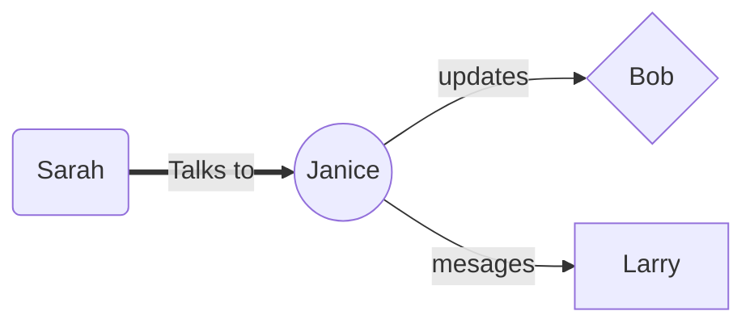

## [BasicStackedit Writing Framework - 20190827 - Stackedit](https://drive.google.com/open?id=16UU7IX9VPWWR9Q0gPX9PgrIq7YBAY-n2)

[1-WritingInProgress - GFolder](https://drive.google.com/drive/folders/1Sq9wYOzPzrTaSoeIcBa-4X1OetmYKgLI)

### Purpose

### Notes, Resources and Links

Key docs:

#### Basic Project Structure
- AUTHORS.md  
- LICENSE  
- README.md
- docs  
  1  final
  2  drafts
  3  text
  4  third-party
- figures  
-  notebooks
-  references
   -   [Publishing with GitHub 20171021 - GDoc](https://docs.google.com/document/d/1Tu_b1oixurg9lId2z3LH_ZiLz1sH9sYD9ypdmZGwE9c/edit#heading=h.q7woux43ig0v)
- reports  
  - figures  
- requirements.txt

##### An example of a sequence chart

##### An example of a top-down chart
```mermaid
graph TD
Love((Love))
Love==>Cat((Cat))
Love==>Dog((Dog))
Cat==Cuddles With==>Teddy((Teddy Bear))
Dog==Protects==>Owner((Owner))
style Love fill:pink, stroke: red, stroke-width: 10px
style Ca

> Save on Google Drive
>   - folder id: 1Sq9wYOzPzrTaSoeIcBa-4X1OetmYKgLI
>   
> Save on Github 
>  - repo: https://github.com/janzeteachesit/janzeteachesit.github.io
>   - path: _drafts/
>   - branch: stackedit
>    
>    Publish to Blogger
>   - blog url: https://blog.janzeteachesit.net
>    
>    Publish to Wordpress
>    - domain: welcome.janzeteachesit.net

> Written with [StackEdit](https://stackedit.io/).
<!--stackedit_data:
eyJoaXN0b3J5IjpbLTEwNjY1MTY1ODAsMTUxMjQzNDc3OSwtNT
U3OTYwMjYzLC0xMzMxMDAzMTA3XX0=
-->